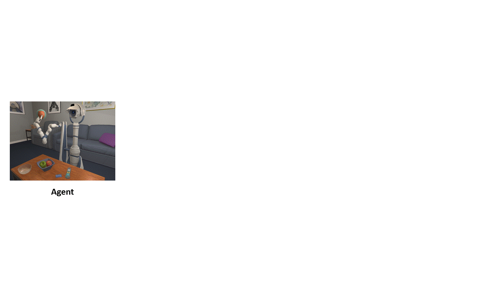

# Learning Object-Centric Representations of Visually Complex Scenes

Learning distributed vector representations has been a driving force behind the remarkable success of deep neural networks in perceptual tasks on ImageNet-like photos with solitary objects (cars, trunks, etc.) in the center. Yet, visual scenes in the real world are often much more sophisticated and composed of multiple entities, including static objects and dynamic agents, that strongly interact with each other.

One emerging paradigm for capturing the compositional nature of complex scenes is to learn slot-based object-centric representations. This approach has demonstrated great promise in tackling difficult problems, such as abstract visual reasoning and out-of-distribution generalization, as well as discovering structural causal representations that permit sparse and independent interventions of each entity. Nevertheless, existing methods to date are still largely limited to simple synthetic settings with low visual complexity.

# Table of Contents

  - [Installation](#installation)
  - [Data](#data)
  - [Setup](#setup)
  - [Notebooks](#notebooks)
  - [Training](#training)
  - [Intervention pair slot consistency](#intervention-pair-slot-consistency)
  - [Contrastive Loss Visualization](#contrastive-loss-visualization)
  - [Evaluation](#evaluation)
  - [Acknowledgements](#Acknowledgements)

## Installation

This repository is tested with Python 3.7.7, PyTorch 1.3.1

To install with pip simply use:

```bash
pip install -r etc/requirements.txt
```
If you prefer to create a conda environment from the YAML file use:

```bash
conda env create -f etc/environment.yml
```

## Data

In general, the dataloader defined in ``/tools/dataloader`` expects the following data structure:

📦proc_00001 <br>
 ┣ 📂bbox <br>
 ┣ 📂color <br>
 ┃ ┣ 📜00001_first.png <br>
 ┃ ┣ ... <br>
 ┃ ┗ 📜00025_second_Bed_dirty.png <br>
 ┣ 📂depth <br>
 ┃ ┣ 📜00001_first.png <br>
 ┃ ┣ ... <br>
 ┃ ┗ 📜00025_second_Bed_dirty.png <br>
 ┣ 📂mask <br>
 ┃ ┣ 📜00001_first.png <br>
 ┃ ┣ ... <br>
 ┃ ┗ 📜00025_second_Bed_dirty.png <br>
 ┣ 📂segmentation <br>
 ┃ ┣ 📜00001_first.png <br>
 ┃ ┣ ... <br>
 ┃ ┗ 📜00025_second_Bed_dirty.png <br>
 ┣ 📂similarity <br>
 ┃ ┣ 📜00001.json <br>
 ┃ ┣ ... <br>
 ┃ ┗ 📜00025.json <br>
 ┣ 📜annotations.csv <br>
 ┗ 📜object_types.json <br>

## Setup

After activating your prefered python environment use the setup file to add the work directories to your **current** python path. Therefore this step has to be repeated e.g. after restart.

```bash
source etc/setup.sh
```
## Notebooks
The notebooks contain tutorials and visualizations for the selected methods. When running the notebooks, make sure that the correct path to the model checkpoint and to the image data is provided.

## Training

Training the model can be done using the training scripts. In this bash script you can set the training parameters like batch size, learning rate etc. as well as the model parameters and the dataset parameters.

```bash
bash train.sh
```
## Intervention pair slot consistency

Inspired by the work of Locatello et al. 2020, one would expect that a sparse intervention should induce an equally sparse change at the representational level and in this instance at the object slot level. However, observing the predicted object masks, it can be seen that previous assumption is not fulfilled for the presented methods. Motivated by this finding, a consistency loss term is introduced in addition to the remaining loss terms of the respective architecture. 

<p align="center">

</p>

## Contrastive Loss Visualization

One of the challenges that is not solved solely with a pairwise solution is the splitting of individual objects into different slots. This is particularly true in cases where the number of slots exceeds the number of objects. As the number of slots is typically overestimated to create enough space for all objects, this effect occurs more often. With the previously presented loss terms, (e.g. reconstruction), no clear incentive is given to partition objects into at most one slot. One idea is to use the previously learned feature map to penalize neighbouring slots that share semantic features, while slices of the same slot should have similar features.
<p align="center">

</p>

## Evaluation

Similar to the training, the evaluation of the model is also possible with the help of a bash script. Depending on the model [Slot Attention, Implicit differentiation] or [SLATE], the respective bash script must be executed with the path to the checkpoint. 

```bash
bash evaluation/eval_slate.sh
```
or
```bash
bash evaluation/eval_slotattention.sh
```
## Acknowledgements
This project is based on the following open-source projects. We thank their authors for making the source code publically available.

- [SLATE](#https://github.com/singhgautam/slate)
